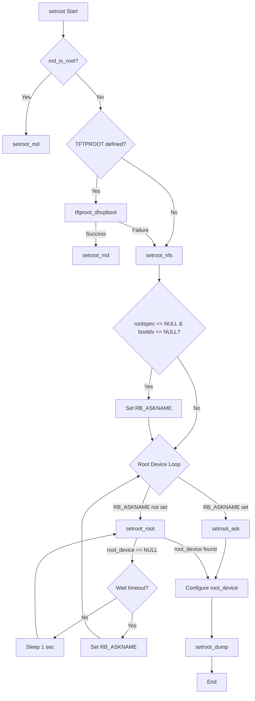
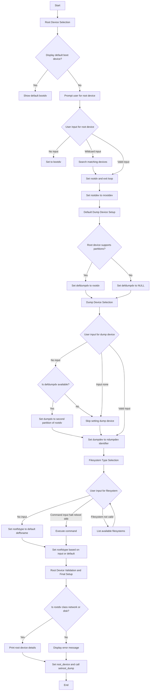

# Setroot:

During a system boot up, based on kernel Config file, system mounts root filesystem. This is handled by setroot function in kern_subr.c. 
device and partition are defined with syntax 
```
config netbsd root on XXX_device type XXX 
```
device name with partition is loaded onto rootspec variable which is used by setroot and associated functions to select a device. device can also be a network device 
in that case a valid interface name should be specified. if instead of a device ' ? ' is specified, setroot uses boot device(from bootspec) as root device.
Boot device is set by findroot function. Findroot is machine dependent. x86/x86_autoconf.c contains function which interact with BIOS entries to configure boot spec variable.
it also has different cases for different device type [Christoph badura's documentation](https://hackmd.io/qS2qYmBNQ9-_C_4gBBzDNQ). 


1. **Primary Functions**:  
* `setroot()`: Main entry point that orchestrates root device selection  
* `setroot_nfs()`: Handles NFS root configuration  
* `setroot_md()`: Sets up memory disk as root device  
* `setroot_ask()`: Interactive root device configuration  
* `setroot_root()`: core root device configuration  
* `setroot_dump()`: Configures dump device  
2. **Key Control Flow**:  
   a) **Initial Setup**:  
      * Checks if config has specified rootdev and partition (through rootspec), otherwise uses dev and partition system booted from ( bootspec)  
      * Verifies if memory disk should be root (md\_is\_root)  
      * Handles TFTPROOT configuration if enabled  

    b) **Device Selection**:    
     * If no boot device and no root specified, enters interactive mode  
     * Waits up to ROOT\_WAITTIME (default 20 seconds) for device availability  
     * Falls back to interactive mode i.e. asks user for root device and dump device if device doesn't appear

    c) **Interactive Configuration (`setroot_ask`)**:  
     * Prompts for root device  
     * Prompts for dump device  
     * Prompts for filesystem type  
     * Supports special commands (halt, reboot, ddb) debugger is only supported if src was built with debugger option  
3. Supported features types:  
  a) **Device Support**:  
    * Handles disk devices with partitions  
    * Supports network interfaces  
    * Supports memory disk devices  
    * Supports disk wedges
   
    b) **Filesystem Support**:  
      * Generic filesystem support  
      * NFS support  
      * Allows custom filesystem type selection
       
    c) **Dump Device Configuration**:  
    * Automatic selection based on root device  
    * Manual configuration support  
    * Support for "none" as dump device  
4. **Important Variables**:  
  * `rootdev`: Device number for root device  
  * `dumpdev`: Device number for dump device  
  * `dumpcdev`: Character device for dumps  
  * `root_device`: Device structure for root device  
  * `booted_device`: Device we booted from   
  * `rootspec`: Specification for root device from config file   
  * `bootspec`: Boot device specification  
5. **Special Handling**:    
a) **NFS Root**:
   - Automatically selects the network interface if needed.
   - Skips partition handling for network devices.    
     
    b) **Memory Disk**:
     - Special handling when `md_is_root` is set.
     - Creates `md0` device if needed.

    c) **Dump Device Selection**:
     - Uses partition 'b' by default on the root disk.
     - Allows "none" as a valid option.
     - Special handling for network root devices.

6. **Error Handling**:  
  * Timeout mechanism for device availability  
  * Fallback to interactive mode on failures  
  * Validation of device and filesystem selections  
  * Clear error messages for invalid selections

# Setroot\_md and md is disk
sets parameter device to md device of name "md0" , after reading the block device.

# Tftproot\_dhcp
The `tftproot_dhcpboot` is to set up a root filesystem for the device using TFTP (Trivial File Transfer Protocol) over NFS (Network File System) based on DHCP (Dynamic Host Configuration Protocol) information. 
1. **Function Signature and Initializations**:
   - `tftproot_dhcpboot` takes a `device_t` type argument `bootdv` (a device pointer to the boot device).
   - Initializes necessary local variables such as `nd` (NFS diskless information), `ifp` (network interface), `trh` (a TFTP root handle), and `error` (initially set to -1, which indicates failure if nothing is done).

2. **Check if Root Specification Exists**:
   - If `rootspec` is non-NULL (indicating a specific network interface was given for booting), the function iterates through all available network interfaces (`IFNET_READER_FOREACH`) to find one matching `rootspec`.
   - If found, it assigns the matching interface to `ifp` and exits the loop.

3. **Fallback to Boot Device**:
   - If no matching interface is found (`ifp` is still NULL) and `bootdv` is non-NULL, the function checks if `bootdv` is a network interface (using `device_class`).
   - It then tries to match `bootdv`'s name (`device_xname(bootdv)`) with the names of available network interfaces, setting `ifp` if a match is found.

4. **Validation of Network Interface**:
   - If `ifp` is still NULL, the function outputs a debug message indicating failure to locate the interface, then jumps to the cleanup and exit section (`out` label).

5. **Find and Validate Root Device**:
   - Calls `device_find_by_xname` to locate the device object for `ifp` using its `if_xname`.
   - If the device (`dv`) is not found or is not of the network interface type (`DV_IFNET`), it logs a debug message and exits.

6. **Assign Root Device and Allocate NFS Structure**:
   - Sets `root_device` to `dv` (the found network device).
   - Assigns `curlwp` (current lightweight process, `l`) and allocates memory for `nd` (an `nfs_diskless` structure), zero-initializing it. This structure will contain essential NFS boot information.
   - Sets `nd->nd_ifp` to `ifp` and marks `nd->nd_nomount` to 1, indicating no mounting is performed during this phase.

7. **NFS Boot Initialization**:
   - Calls `nfs_boot_init`, which initializes network-based boot information for NFS using `nd` and `l`. If this function fails, it logs a debug message and exits.

8. **Remove TFTP Prefix from Boot File**:
   - Strips the "tftp:" prefix from `nd->nd_bootfile`, which represents the boot file path. If the boot file starts with "tftp:", it removes this prefix for easier handling in subsequent steps.

9. **TFTP Root Handle Setup and File Retrieval**:
   - Initializes `trh` to zero and assigns `nd` to `trh.trh_nd`, setting the `trh_block` to 1.
   - Calls `tftproot_getfile`, which retrieves the boot file via TFTP. If this function fails, it logs a debug message and exits.

10. **Final Error Handling and Cleanup**:
	- Sets `error` to 0, indicating success.
	- In the `out` label section, it frees the allocated `nd` memory if it was allocated.
	- Returns `error`, which will be 0 on success or an error code if any part of the function failed.

### Function Workflow
The `tftproot_dhcpboot` function:
1. Determines the appropriate network interface (`ifp`) using either `rootspec` or `bootdv`.
2. Ensures the found device is a network interface.
3. Allocates and initializes an NFS diskless structure.
4. Sets up the root device and initializes boot information for NFS.
5. Prepares the TFTP boot file by stripping unnecessary prefixes.
6. Retrieves the boot file via TFTP and returns success or failure.

# Setroot\_ask


# Setroot\_root

#### **Purpose**

The `setroot_root` function is responsible for configuring the root device of the system during the boot process if root device was specified and boot device was found. It selects the appropriate root device based on a specified configuration (`rootspec`) or falls back to the boot device if `rootspec` is not defined. This function also determines the major device number and partition of the root device, ensuring that the system can mount the root filesystem correctly.

#### **Parameters**

* **`device_t bootdv`**: Represents the device from which the system was booted. It serves as the default root device if no specific root device is provided by `rootspec`.  
* **`int bootpartition`**: Specifies the partition number of the boot device. Used when the root device is a disk with partitions.

#### **Internal Variables**

* **`device_t rootdv`**: The selected root device, determined either from `rootspec` or defaulted to the boot device (`bootdv`).  
* **`int majdev`**: Holds the major device number of the root device, which is used to identify the device type in the system.  
* **`const char *rootdevname`**: Name of the root device based on the major number, used in error messages or device identification.  
* **`char buf[128]`**: Buffer to store the root device name, used for formatted messages.  
* **`dev_t nrootdev`**: Represents the device number parsed from `rootspec`.

#### **Function Workflow**

1. **Checking for Root Device Specification (`rootspec`)**:  
   * If `rootspec` is `NULL`, the function defaults to using `bootdv` as the root device.  
   * If `bootdv` is defined, `majdev` is assigned the major number of `bootdv`.  
   * For disk devices, it calculates the root device ID (`rootdev`) using `MAKEDISKDEV` if the device uses partitions, or `makedev` otherwise.  
2. **Parsing the `rootspec`**:  
   * If `rootspec` is defined, `parsedisk` attempts to parse it and assign the resulting device to `rootdv`.  
   * If parsing fails, `rootdev` and `rootdv` are computed from the major device name (`rootdevname`) and device unit.  
   * The function then calls `finddevice` to locate `rootdv` based on the constructed device name in `buf`.  
3. **Error Handling**:  
   * If `majdev` is invalid or `rootdv` is `NULL`, error messages are printed, and the function exits early.  
4. **Final Root Device Determination**:  
   * After successfully identifying `rootdv`, the function checks the device class of `rootdv` to ensure it is either a network interface (`DV_IFNET`) or a disk (`DV_DISK`).  
   * It then displays the name of the root device and appends the partition letter if the device supports partitions.  
5. **Setting Global Root Device**:  
   * The global `root_device` is assigned to `rootdv`, and `setroot_dump` is called to complete the root device setup.

#### **Notes**

* **Device and Partition Handling**: The function is designed to handle both partitioned and non-partitioned devices gracefully.  
* **Error Reporting**: Provides error messages when the root device cannot be determined.  
* **Flexibility**: The function supports dynamic root device specification via `rootspec`, making it adaptable to various boot configurations.

# 
